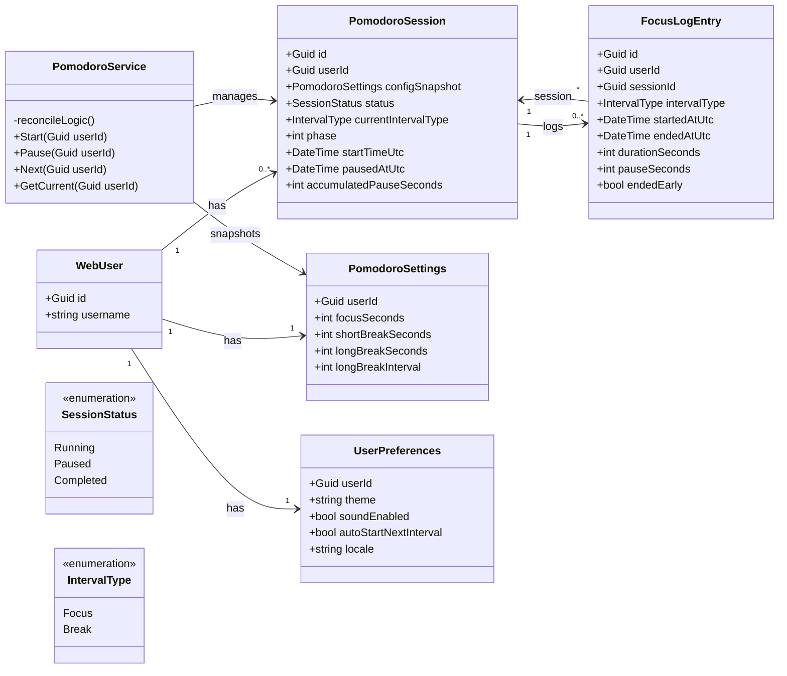

```mermaid
classDiagram
direction LR

class WebUser {
  +Guid id
  +string username
}

class PomodoroService {
  -reconcileLogic()
  +Start(Guid userId)
  +Pause(Guid userId)
  +Next(Guid userId)
  +GetCurrent(Guid userId)
}

class PomodoroSession {
  +Guid id
  +Guid userId
  +PomodoroSettings configSnapshot
  +SessionStatus status
  +IntervalType currentIntervalType
  +int phase
  +DateTime startTimeUtc
  +DateTime pausedAtUtc
  +int accumulatedPauseSeconds
}

class PomodoroSettings {
  +Guid userId
  +int focusSeconds
  +int shortBreakSeconds
  +int longBreakSeconds
  +int longBreakInterval
}

class UserPreferences {
  +Guid userId
  +string theme
  +bool soundEnabled
  +bool autoStartNextInterval
  +string locale
}

class FocusLogEntry {
  +Guid id
  +Guid userId
  +Guid sessionId
  +IntervalType intervalType
  +DateTime startedAtUtc
  +DateTime endedAtUtc
  +int durationSeconds
  +int pauseSeconds
  +bool endedEarly
}

class SessionStatus {
  <<enumeration>>
  Running
  Paused
  Completed
}

class IntervalType {
  <<enumeration>>
  Focus
  Break
}

WebUser "1" --> "0..*" PomodoroSession : has
WebUser "1" --> "1" PomodoroSettings : has
WebUser "1" --> "1" UserPreferences : has
PomodoroSession "1" --> "0..*" FocusLogEntry : logs
FocusLogEntry "*" --> "1" PomodoroSession : session
PomodoroService --> PomodoroSession : manages
PomodoroService --> PomodoroSettings : snapshots


```