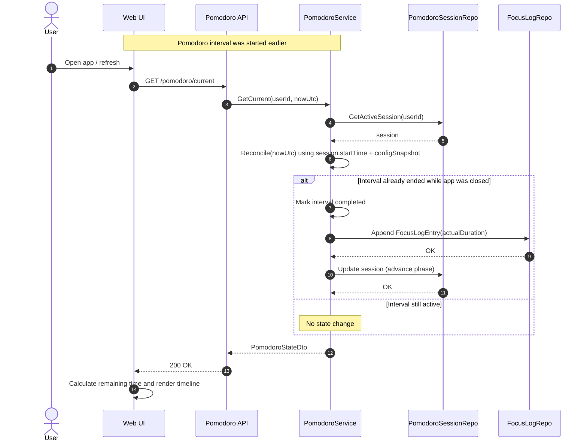

## Changing Pomodoro settings during active Pomodoro session

This Sequence diagram is illustrating what happens if user resumes the pomodoro timer or refreshes the web page during an active timer.

## Sequence Diagram

