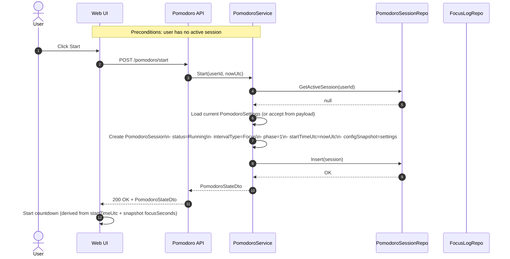

```mermaid
sequenceDiagram
    autonumber
    actor U as User
    participant UI as Web UI
    participant API as Pomodoro API
    participant SVC as PomodoroService
    participant SessRepo as PomodoroSessionRepo
    participant LogRepo as FocusLogRepo

    Note over UI,SVC: Preconditions: user has no active session

    U->>UI: Click Start
    UI->>API: POST /pomodoro/start
    API->>SVC: Start(userId, nowUtc)

    SVC->>SessRepo: GetActiveSession(userId)
    SessRepo-->>SVC: null

    SVC->>SVC: Load current PomodoroSettings (or accept from payload)
    SVC->>SVC: Create PomodoroSession\n- status=Running\n- intervalType=Focus\n- phase=1\n- startTimeUtc=nowUtc\n- configSnapshot=settings

    SVC->>SessRepo: Insert(session)
    SessRepo-->>SVC: OK

    SVC-->>API: PomodoroStateDto
    API-->>UI: 200 OK + PomodoroStateDto
    UI->>UI: Start countdown (derived from startTimeUtc + snapshot focusSeconds)

```