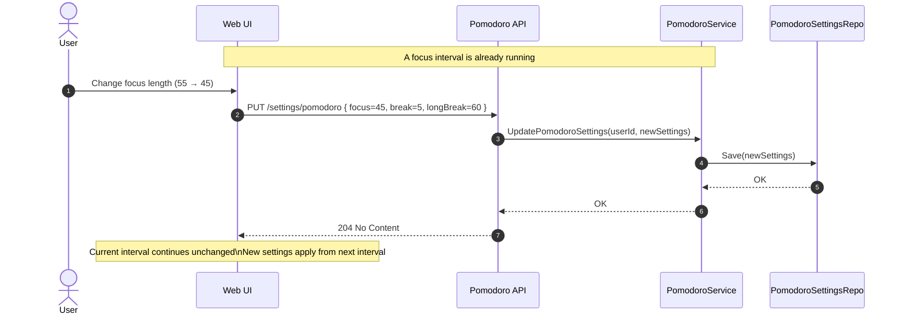

## Changing Pomodoro settings during active Pomodoro session

This Sequence diagram is illustrating what happens if user changes Pomodoro Settings while a pomodoro sessions is running.

User updates settings → current interval is NOT affected → new settings apply next interval.

## Sequence Diagram

