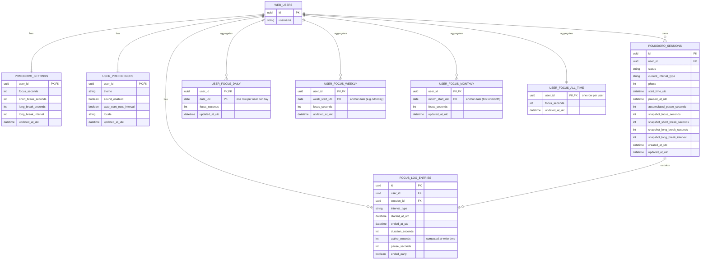

```mermaid
erDiagram
    WEB_USERS ||--|| POMODORO_SETTINGS : has
    WEB_USERS ||--|| USER_PREFERENCES : has
    WEB_USERS ||--o{ POMODORO_SESSIONS : owns
    WEB_USERS ||--o{ FOCUS_LOG_ENTRIES : has
    POMODORO_SESSIONS ||--o{ FOCUS_LOG_ENTRIES : contains

    WEB_USERS ||--o{ USER_FOCUS_DAILY : aggregates
    WEB_USERS ||--o{ USER_FOCUS_WEEKLY : aggregates
    WEB_USERS ||--o{ USER_FOCUS_MONTHLY : aggregates
    WEB_USERS ||--|| USER_FOCUS_ALL_TIME : aggregates

    WEB_USERS {
        uuid id PK
        string username
    }

    POMODORO_SETTINGS {
        uuid user_id PK, FK
        int focus_seconds
        int short_break_seconds
        int long_break_seconds
        int long_break_interval
        datetime updated_at_utc
    }

    USER_PREFERENCES {
        uuid user_id PK, FK
        string theme
        boolean sound_enabled
        boolean auto_start_next_interval
        string locale
        datetime updated_at_utc
    }

    POMODORO_SESSIONS {
        uuid id PK
        uuid user_id FK
        string status
        string current_interval_type
        int phase
        datetime start_time_utc
        datetime paused_at_utc
        int accumulated_pause_seconds

        int snapshot_focus_seconds
        int snapshot_short_break_seconds
        int snapshot_long_break_seconds
        int snapshot_long_break_interval

        datetime created_at_utc
        datetime updated_at_utc
    }

    FOCUS_LOG_ENTRIES {
        uuid id PK
        uuid user_id FK
        uuid session_id FK
        string interval_type
        datetime started_at_utc
        datetime ended_at_utc
        int duration_seconds
        int active_seconds "computed at write-time"
        int pause_seconds
        boolean ended_early
    }

    USER_FOCUS_DAILY {
        uuid user_id PK, FK
        date date_utc PK                 "one row per user per day"
        int focus_seconds
        datetime updated_at_utc
    }

    USER_FOCUS_WEEKLY {
        uuid user_id PK, FK
        date week_start_utc PK           "anchor date (e.g. Monday)"
        int focus_seconds
        datetime updated_at_utc
    }

    USER_FOCUS_MONTHLY {
        uuid user_id PK, FK
        date month_start_utc PK          "anchor date (first of month)"
        int focus_seconds
        datetime updated_at_utc
    }

    USER_FOCUS_ALL_TIME {
        uuid user_id PK, FK              "one row per user"
        int focus_seconds
        datetime updated_at_utc
    }


```