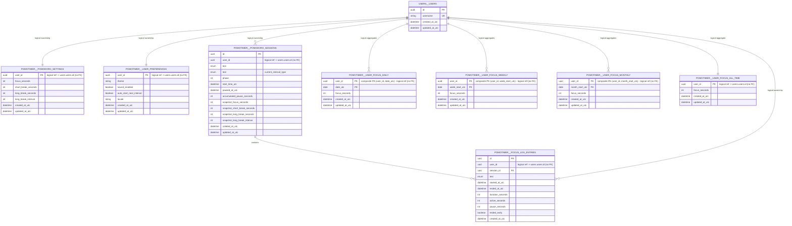

```mermaid
erDiagram
    %% NOTE:
    %% Users and Pomotimer are separate services/schemas.
    %% Pomotimer stores user_id as a UUID that logically references Users.id,
    %% but there is NO DB FK across schemas/services.
    %% The only real FK here is inside pomotimer (focus_log_entries.session_id -> pomodoro_sessions.id).

    USERS__USERS {
        uuid id PK
        string username UK
        datetime created_at_utc
        datetime updated_at_utc
    }

    POMOTIMER__POMODORO_SETTINGS {
        uuid user_id PK  "logical ref -> users.users.id (no FK)"
        int focus_seconds
        int short_break_seconds
        int long_break_seconds
        int long_break_interval
        datetime created_at_utc
        datetime updated_at_utc
    }

    POMOTIMER__USER_PREFERENCES {
        uuid user_id PK  "logical ref -> users.users.id (no FK)"
        string theme
        boolean sound_enabled
        boolean auto_start_next_interval
        string locale
        datetime created_at_utc
        datetime updated_at_utc
    }

    POMOTIMER__POMODORO_SESSIONS {
        uuid id PK
        uuid user_id  "logical ref -> users.users.id (no FK)"
        enum text
        enum text "current_interval_type"
        int phase
        datetime start_time_utc
        datetime paused_at_utc
        int accumulated_pause_seconds
        int snapshot_focus_seconds
        int snapshot_short_break_seconds
        int snapshot_long_break_seconds
        int snapshot_long_break_interval
        datetime created_at_utc
        datetime updated_at_utc
    }

    POMOTIMER__FOCUS_LOG_ENTRIES {
        uuid id PK
        uuid user_id  "logical ref -> users.users.id (no FK)"
        uuid session_id FK
        enum text
        datetime started_at_utc
        datetime ended_at_utc
        int duration_seconds
        int active_seconds
        int pause_seconds
        boolean ended_early
        datetime created_at_utc
    }

    POMOTIMER__USER_FOCUS_DAILY {
        uuid user_id PK  "composite PK (user_id, date_utc) - logical ref (no FK)"
        date date_utc PK
        int focus_seconds
        datetime created_at_utc
        datetime updated_at_utc
    }

    POMOTIMER__USER_FOCUS_WEEKLY {
        uuid user_id PK  "composite PK (user_id, week_start_utc) - logical ref (no FK)"
        date week_start_utc PK
        int focus_seconds
        datetime created_at_utc
        datetime updated_at_utc
    }

    POMOTIMER__USER_FOCUS_MONTHLY {
        uuid user_id PK  "composite PK (user_id, month_start_utc) - logical ref (no FK)"
        date month_start_utc PK
        int focus_seconds
        datetime created_at_utc
        datetime updated_at_utc
    }

    POMOTIMER__USER_FOCUS_ALL_TIME {
        uuid user_id PK  "logical ref -> users.users.id (no FK)"
        int focus_seconds
        datetime created_at_utc
        datetime updated_at_utc
    }

    %% Internal (real) relationship inside Pomotimer schema
    POMOTIMER__POMODORO_SESSIONS ||--o{ POMOTIMER__FOCUS_LOG_ENTRIES : contains

    %% Cross-service relationships are conceptual only (no DB FK)
    USERS__USERS ||--|| POMOTIMER__POMODORO_SETTINGS : "logical ownership"
    USERS__USERS ||--|| POMOTIMER__USER_PREFERENCES : "logical ownership"
    USERS__USERS ||--o{ POMOTIMER__POMODORO_SESSIONS : "logical ownership"
    USERS__USERS ||--o{ POMOTIMER__FOCUS_LOG_ENTRIES : "logical ownership"

    USERS__USERS ||--o{ POMOTIMER__USER_FOCUS_DAILY : "logical aggregates"
    USERS__USERS ||--o{ POMOTIMER__USER_FOCUS_WEEKLY : "logical aggregates"
    USERS__USERS ||--o{ POMOTIMER__USER_FOCUS_MONTHLY : "logical aggregates"
    USERS__USERS ||--|| POMOTIMER__USER_FOCUS_ALL_TIME : "logical aggregate"


```