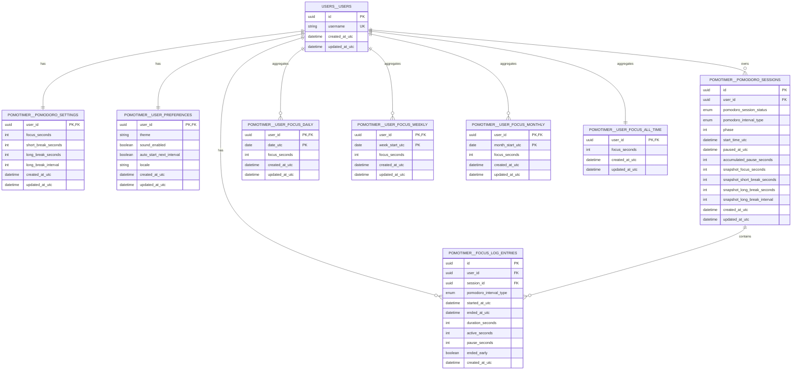

```mermaid
erDiagram
    USERS__USERS ||--|| POMOTIMER__POMODORO_SETTINGS : has
    USERS__USERS ||--|| POMOTIMER__USER_PREFERENCES : has
    USERS__USERS ||--o{ POMOTIMER__POMODORO_SESSIONS : owns
    USERS__USERS ||--o{ POMOTIMER__FOCUS_LOG_ENTRIES : has
    POMOTIMER__POMODORO_SESSIONS ||--o{ POMOTIMER__FOCUS_LOG_ENTRIES : contains

    USERS__USERS ||--o{ POMOTIMER__USER_FOCUS_DAILY : aggregates
    USERS__USERS ||--o{ POMOTIMER__USER_FOCUS_WEEKLY : aggregates
    USERS__USERS ||--o{ POMOTIMER__USER_FOCUS_MONTHLY : aggregates
    USERS__USERS ||--|| POMOTIMER__USER_FOCUS_ALL_TIME : aggregates

    %% "Schema-qualified" naming shown using USERS__ and POMOTIMER__ prefixes
    USERS__USERS {
        uuid id PK
        string username UK
        datetime created_at_utc
        datetime updated_at_utc
    }

    POMOTIMER__POMODORO_SETTINGS {
        uuid user_id PK, FK
        int focus_seconds
        int short_break_seconds
        int long_break_seconds
        int long_break_interval
        datetime created_at_utc
        datetime updated_at_utc
    }

    POMOTIMER__USER_PREFERENCES {
        uuid user_id PK, FK
        string theme
        boolean sound_enabled
        boolean auto_start_next_interval
        string locale
        datetime created_at_utc
        datetime updated_at_utc
    }

    POMOTIMER__POMODORO_SESSIONS {
        uuid id PK
        uuid user_id FK
        enum pomodoro_session_status
        enum pomodoro_interval_type
        int phase
        datetime start_time_utc
        datetime paused_at_utc
        int accumulated_pause_seconds
        int snapshot_focus_seconds
        int snapshot_short_break_seconds
        int snapshot_long_break_seconds
        int snapshot_long_break_interval
        datetime created_at_utc
        datetime updated_at_utc
    }

    POMOTIMER__FOCUS_LOG_ENTRIES {
        uuid id PK
        uuid user_id FK
        uuid session_id FK
        enum pomodoro_interval_type
        datetime started_at_utc
        datetime ended_at_utc
        int duration_seconds
        int active_seconds
        int pause_seconds
        boolean ended_early
        datetime created_at_utc
    }

    POMOTIMER__USER_FOCUS_DAILY {
        uuid user_id PK, FK
        date date_utc PK
        int focus_seconds
        datetime created_at_utc
        datetime updated_at_utc
    }

    POMOTIMER__USER_FOCUS_WEEKLY {
        uuid user_id PK, FK
        date week_start_utc PK
        int focus_seconds
        datetime created_at_utc
        datetime updated_at_utc
    }

    POMOTIMER__USER_FOCUS_MONTHLY {
        uuid user_id PK, FK
        date month_start_utc PK
        int focus_seconds
        datetime created_at_utc
        datetime updated_at_utc
    }

    POMOTIMER__USER_FOCUS_ALL_TIME {
        uuid user_id PK, FK
        int focus_seconds
        datetime created_at_utc
        datetime updated_at_utc
    }

```